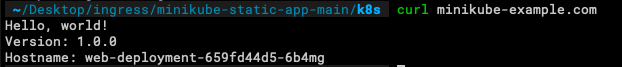

##**Running Minikube**


###Windows
```bash
$ minikube start --driver=virtualbox
```

###MacOS
```bash
$ minikube start --vm-driver=hyperkit
```


&nbsp;

##Enable the Ingress controller

1. **To enable the NGINX Ingress controller, run the following command:**

    &nbsp;
    ```bash
    $ minikube addons enable ingress
    ```
     
    &nbsp;


2. **Verify that the NGINX Ingress controller is running:**
    &nbsp;
    ```bash
    $ kubectl get pods -n ingress-nginx
    ```
    The output is similar to:

    


##Deploy a hello world app
1. Create a Namespace:
    &nbsp;
    ```bash
    $ kubectl apply -f namespace.yaml
    ```
    
    The output should be:
    

    &nbsp;
2. **Create a Deployment using the following command:**

    ```bash
    $ kubectl apply -f deployment.yaml
    ```

    The output should be:
    

    &nbsp;
3. **Create the Service:**

    &nbsp;
    ```bash
    $ kubectl apply -f service.yaml
    ```

    The output should be:
    

    &nbsp;
4. **Verify the Service is created and is available on a node port:**
    &nbsp;
 
    ```bash
    $ kubectl get service web-service -n sample
    ```
    
    The output is similar to:
    

    &nbsp;
5. **Visit the Service via NodePort:**
    &nbsp;
    ```bash
    $ minikube service web-service -n sample --url
    ```
    
    The output is similar to:
    

    &nbsp;
##Create an Ingress

The following manifest defines an Ingress that sends traffic to your Service via minikube-example.com.

1. **Create example-ingress.yaml from the following file:**
    
    &nbsp;
    ```bash
    $ kubectl apply -f example-ingress.yaml
    ```

    The output should be:
    

    &nbsp;

2. **Verify the IP address is set:**
    &nbsp;

    ```bash
    $ kubectl get ingress -n sample
    ```

    You should see an IPv4 address in the ADDRESS column; for example:
    &nbsp;
    

    &nbsp;
3. **Add the following line to the bottom of the /etc/hosts file on your computer (you will need administrator access):**

    &nbsp;

   ```bash
   $ 172.17.0.15 minikube-example.com
   ```
    > Note: If you are running **Minikube** locally, use **minikube ip** to get the external IP. The IP address displayed within the ingress list will be the internal IP.

    After you make this change, your web browser sends requests for minikube-example.com URLs to Minikube.

    &nbsp;
4. **Verify that the Ingress controller is directing traffic:**
    &nbsp;
    ```bash
    $ curl minikube-example.com
    ```

    You should see:
    
